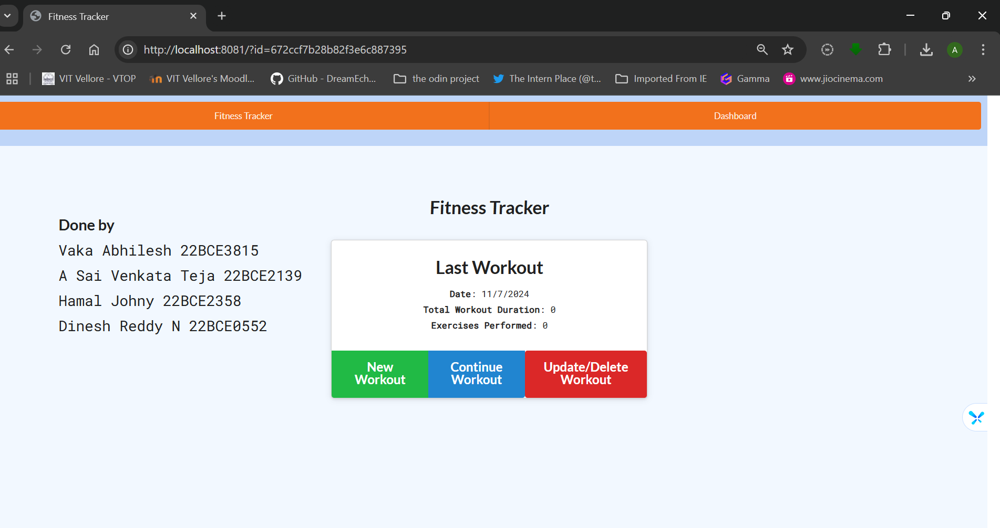
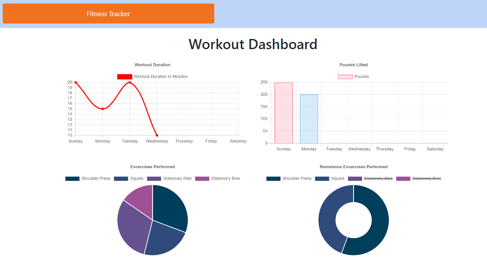

# MongoDB Fitness Tracker

 

  ## Description:
  I created an app using Express, Mongoose, and MongoDB to help users track their fitness progress over time. The app allows users to enter their fitness data, such as workouts and the exercises they did during those workouts. This information is stored in a NoSQL database.

In the app, I used Mongoose to define a schema, where "Exercises" is included as a field inside "Workouts." I also took advantage of Mongoose's discriminator feature to make it easier to extend and reuse the attributes of an Exercise.

Lastly, I used Mongoose's virtual attribute to automatically calculate the total duration of a workout, which gets shown on the homepage.

  ## Table of Contents
 * [Usage](#Usage)
 * [Questions](#Questions)

  ## Usage

  Create a new workout or add to an existing one.

  Each exercise can be either cardio or resistance.

  View your progress over time on the dashboard and current stats on the homepage.

  ## Questions

  Please address questions to GAFelton.

  [Link to Profile](https://github.com/Abhilesh-Vaka)

  [E-mail](vakaabhilesh@gmail.com)

